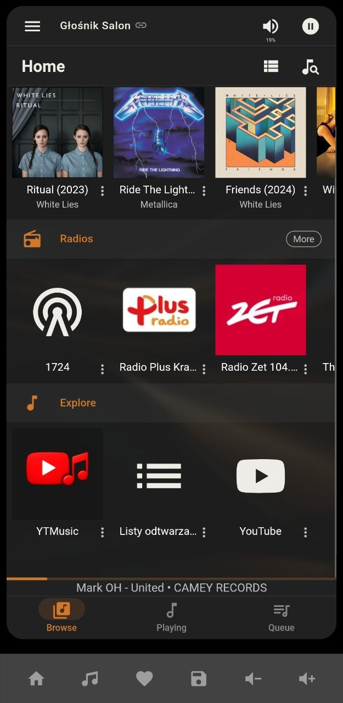
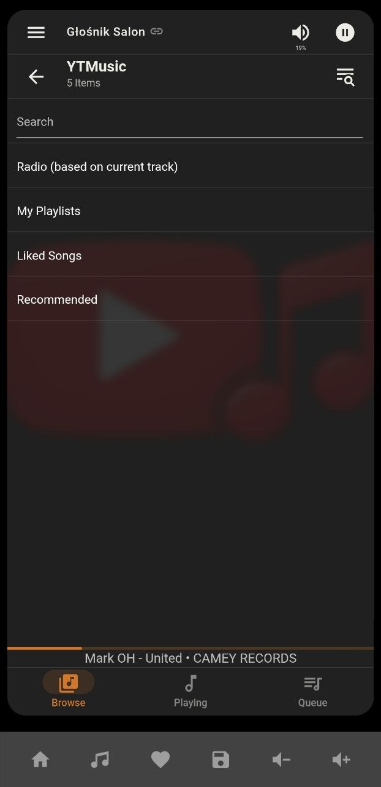
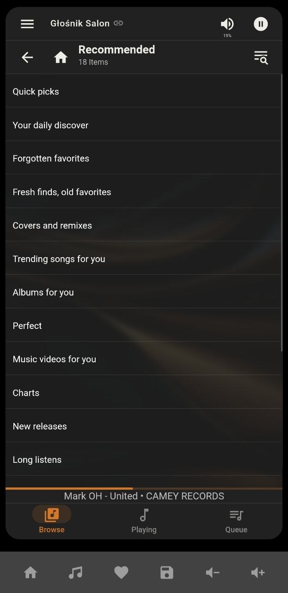
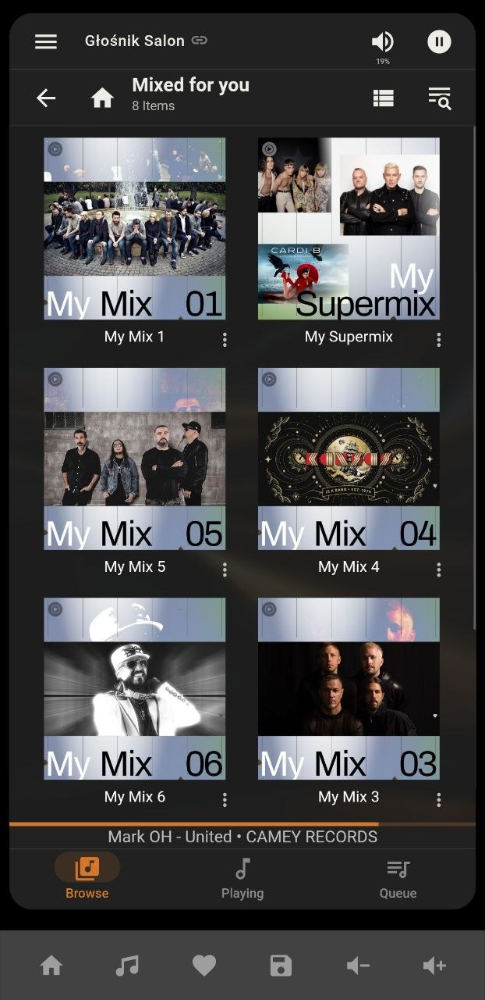
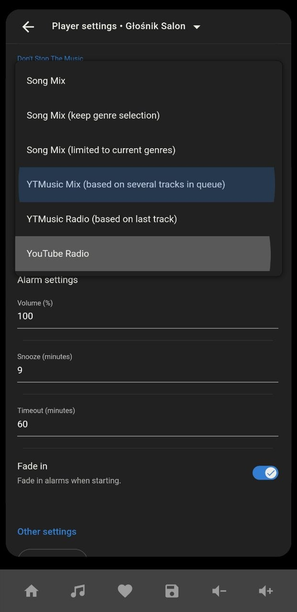
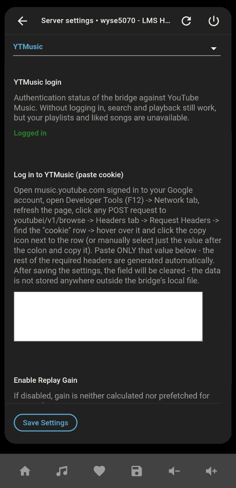

# YTMusic — a YouTube Music plugin for the Lyrion Music Server (LMS) add-on in Home Assistant OS.

🇵🇱 [Polish version / Wersja polska](https://github.com/Controli-pl/lms-ytmusic/blob/main/PL/README.md)

A plugin that integrates YouTube Music with Lyrion Music Server (formerly Logitech/Squeezebox Server).
It lets you browse, search, and play music from YouTube Music on all Squeezebox/LMS players, with full ReplayGain support, DSTM support, and Home Assistant integration via CLI commands.
It can work in two modes — with or without authorization (see below).
After authorization you gain:
- browsing your YT playlists
- browsing recommendations
- the ability to "Like" tracks.

## Screenshots

| | | | | | |
|---|---|---|---|---|---|
|  |  |  |  |  |  |

## Disclaimer

This plugin is a private, independent project. It relies on Python libraries and may stop working at any time if Google changes its API.
Use it at your own risk and in accordance with YouTube's Terms of Service. The current version is tailored to the LMS add-on for Home Assistant installed on x86-64 hardware.

## Requirements
- Lyrion Music Server 9.1 (Gain support) or newer
- A server running LMS together with Home Assistant: Linux, x86-64 (amd64). Other platforms (Raspberry Pi/ARM, macOS, native Windows) are not currently supported — see the Limitations section.

## How it works
The project consists of two parts:

- **LMS Plugin (Perl)** — integrates with the menu, playback queue, DSTM, ReplayGain, and the LMS CLI/JSON-RPC interface.
- **Bridge (Python, `ytmusic_bridge`)** — a local HTTP server (`127.0.0.1:8008`) that communicates with YouTube Music (via `ytmusicapi`) and downloads/remuxes audio streams (via `yt-dlp` + `ffmpeg`).

The Bridge is started and managed automatically by the plugin.

## Features

### Browsing and playback
- **Search** for tracks.
- **Recommended** — recommendations from YouTube Music (sections like "Mixed for you", "My Mix 1-6", etc.), with a preview of section contents and the ability to play/add an entire section at once.
- **My playlists** — playlists from your YouTube Music library.
- **Liked songs** — your library of liked tracks.
- **Radio** — based on the most recently played track, started from the main menu or from a track's context menu (appends the radio to the queue).
- **Track context menu** — Like, Quick save (to an auto-created "Saved from LMS" playlist), Add to a specific playlist, Search in YTMusic (for tracks from other sources, e.g. your local library).
- **Don't Stop The Music integration** — two modes: Radio (based on the last track) and Mix (based on several of the last tracks in the queue, results mixed alternately between the seeds).
- **Seeking** — full seek support during playback.


### ReplayGain

~~Tracks served by YouTube often have very different loudness levels, which used to noticeably spoil the experience when listening to a longer playlist without constant supervision. That's why the plugin calculates and applies ReplayGain automatically, without needing to pre-analyze your entire library:~~

- ~~**Quick measurement** (first ~25s of a track) — applied immediately on first playback and when prefetching tracks in the queue, so it doesn't block playback from starting.~~
- ~~**Deep analysis** — once a configured percentage of the track's actually-listened duration is exceeded, the plugin requests a more precise measurement in the background (half the track or the whole track) and remembers it for the future. This fixes cases of tracks with a quiet intro and a loud section later on, where a short analysis produced an inflated gain value. Tracks that are skipped quickly are not re-analyzed — zero unnecessary CPU load.~~
- ~~**Persistent cache** — calculated gain values are permanently saved by the Bridge (they survive an LMS restart), with increasing quality (quick → half → full track), never degraded downward.~~
- ~~**Prefetch** — gain for upcoming tracks in the queue is calculated ahead of time, in the background, including for tracks inserted via "Play next".~~

~~Settings (Settings → Advanced → YTMusic in the LMS interface):~~

| ~~Setting~~ | ~~Description~~ |
|---|---|
| ~~Enable Replay Gain~~ | ~~Main switch — when off, gain is neither calculated nor applied for any track~~ |
| ~~Minimum volume for gain calculation~~ | ~~New gain is calculated only when at least one connected player has volume above this value (0 = always calculated, regardless of volume)~~ |
| ~~Listening threshold for deep analysis~~ | ~~After what % of a track's actual listening time a more precise analysis is requested~~ |
| ~~Deep analysis scope~~ | ~~25 seconds (no deepening — disables the mechanism), half the track, or the whole track (most accurate)~~ |

ReplayGain no longer uses quick/prefetch/deep-analysis against YouTube. Gain is measured once as a side effect of real playback (ebur128 on already-fetched audio), with a configurable analysis scope and a volume-gated temporary default for first plays; the old min-volume setting no longer means “don’t calculate.”

| Setting | Description |
|---|---|
| Enable Replay GainMaster switch. | Off → no correction and no background measurement (nogain=1). On → cached gain is always applied; unknown tracks may get a temporary default; measurement still runs during playback and fills the cache. |
| Min. volume to apply default gain | Only when a track has no measured gain yet: above this volume the Default gain value is applied for that first play. Below it, first play has no correction. Does not stop background measurement and does not block applying an already cached gain. 0 = always allow the default on first play. |
| Default gain until measured | Temporary dB offset for first play of an unmeasured track (when volume is above the threshold). Real measurement runs in the background during that play and is used from the next play onward. Negative = safer (quieter) first listen.Gain analysis scopeHow much of the track to analyze (¼ / ½ / full). Runs in the background on playback of a track without a measurement of this quality or better (typically the first play). Shorter = less CPU. |
| Bridge log level | Log level of the Python bridge process (DEBUG only while troubleshooting). Takes effect on Save without rebuilding the binary. |


## CLI / JSON-RPC commands (for use with Home Assistant)

All commands are invoked through the Squeezebox integration services: `squeezebox.call_query` (queries, result in `query_result`) or `squeezebox.call_method` (actions, no return value).

### Search and playback

**Search** (does not require a player):
```yaml
service: squeezebox.call_query
data:
  entity_id: media_player.your_player
  command: ytmusic
  parameters:
    - search
    - "search:track name"
```
Returns `count` and an `item_loop` list with `title`/`artist`/`url`/`image`.

**Radio based on the currently playing track** (requires a player, replaces the rest of the queue with radio):
```yaml
service: squeezebox.call_method
data:
  entity_id: media_player.your_player
  command: ytmusic
  parameters:
    - trackradio
```

**Radio based on any track** (e.g. from search results — clears the queue and starts immediately from the given `video_id`):
```yaml
service: squeezebox.call_method
data:
  entity_id: media_player.your_player
  command: ytmusic
  parameters:
    - playradio
    - "video_id:BSTsnWoslP4"
```

**Like the currently playing track:**
```yaml
service: squeezebox.call_method
data:
  entity_id: media_player.your_player
  command: ytmusic
  parameters:
    - like
```

**Quick save the currently playing track** (to the "Saved from LMS" playlist):
```yaml
service: squeezebox.call_method
data:
  entity_id: media_player.your_player
  command: ytmusic
  parameters:
    - save
```

### Playlists

**List playlists from your library:**
```yaml
service: squeezebox.call_query
data:
  entity_id: media_player.your_player
  command: ytmusic
  parameters:
    - playlists
```
Returns `count` and `item_loop` with `title`/`playlist_id`/`image`.

**List recommended playlists from the "Recommended" section** (e.g. "My Mix 1", "My Supermix", etc.):
```yaml
service: squeezebox.call_query
data:
  entity_id: media_player.your_player
  command: ytmusic
  parameters:
    - homeplaylists
```
Returns `count` and `item_loop` with `title`/`playlist_id`/`section`/`image`.

**Contents of a specific playlist** (preview of tracks, does not play):
```yaml
service: squeezebox.call_query
data:
  entity_id: media_player.your_player
  command: ytmusic
  parameters:
    - playlisttracks
    - "playlist_id:YOUR_ID"
```

**Play an entire playlist immediately** (clears the queue, adds all tracks, plays):
```yaml
service: squeezebox.call_method
data:
  entity_id: media_player.your_player
  command: ytmusic
  parameters:
    - playplaylist
    - "playlist_id:YOUR_ID"
```

**Append an entire playlist to the end of the queue** (without clearing/playing):
```yaml
service: squeezebox.call_method
data:
  entity_id: media_player.your_player
  command: ytmusic
  parameters:
    - addplaylist
    - "playlist_id:YOUR_ID"
```

**Play/append tracks from a "flat" Recommended section** (e.g. sections like "Your daily discover", which contain individual tracks rather than playlists):
```yaml
service: squeezebox.call_method
data:
  entity_id: media_player.your_player
  command: ytmusic
  parameters:
    - playhomesection
    - "section:Your daily discover"
```
(similarly `addhomesection` to append without clearing the queue)

### Managing ReplayGain from automations

Lets you temporarily (until the next LMS restart) override the Settings panel values without writing anything to disk — useful e.g. for automations like "enable precise gain at night" or "force gain calculation regardless of volume after 10 PM".

**Enable/disable the main gain switch:**
```yaml
service: squeezebox.call_query
data:
  entity_id: media_player.your_player
  command: ytmusic
  parameters:
    - replaygain
    - "1"   # or "0", or "clear" (remove the override, revert to the panel settings), or "status" (read-only)
```
Returns `enabled` (current effective state) and `override` (`none` when inactive).

**Change/disable the volume threshold:**
```yaml
service: squeezebox.call_query
data:
  entity_id: media_player.your_player
  command: ytmusic
  parameters:
    - replaygainvolume
    - "30"   # or "0" (always calculate gain), or "clear", or "status"
```
Returns `min_volume` and `override`.

## Requirements and installation

1. **Installation via repository** — in LMS: Settings → Plugins → Additional Repositories, paste the repo address:

   https://raw.githubusercontent.com/Controli-pl/lms-ytmusic/refs/heads/main/YTMusic/repo.xml

   save, and refresh the plugin list. Install "YTMusic" from the list.
   
3. **YouTube Music authentication** (required for: playlists, liked tracks, liking, quick save, adding to playlists — search and playback work without it).

### Generating the authentication file

1. Open `music.youtube.com` in your browser (preferably in incognito mode) and log in to your account.
2. Open Developer Tools (F12) → **Network** tab.
3. Type `browse` in the filter field.
4. Click on a playlist/library to generate a `POST .../browse?...` request.
5. Click on that request → **Headers** → **Request Headers** → copy the value of the cookie key (see image below).


6. Paste the copied value and confirm. (The saved file is stored exclusively locally on your device!)
7. The status field value should change to "Logged in".

**Note:** the authentication token expires after some time. If features requiring login start returning an "auth?" error in the logs, repeat the steps above.

## Support and feedback

I'm not a professional programmer — this is a hobby project I built for my own use. If you have reasonable suggestions, feature requests, or run into bugs, feel free to open an [issue](../../issues) and I'll try to help. That said, my free time is limited (and honestly, I should probably focus more on... real life and making a living 😅), so please be patient — responses may take a while.

If you'd like to support the project:

- ☕ [Buy me a coffee](https://buymeacoffee.com/controli)
- 💬 Say thanks in the [Discussions thread](https://github.com/Controli-pl/lms-ytmusic/discussions/1)
- ⭐ Or just leave a star — it costs nothing, but it's a great motivator!
